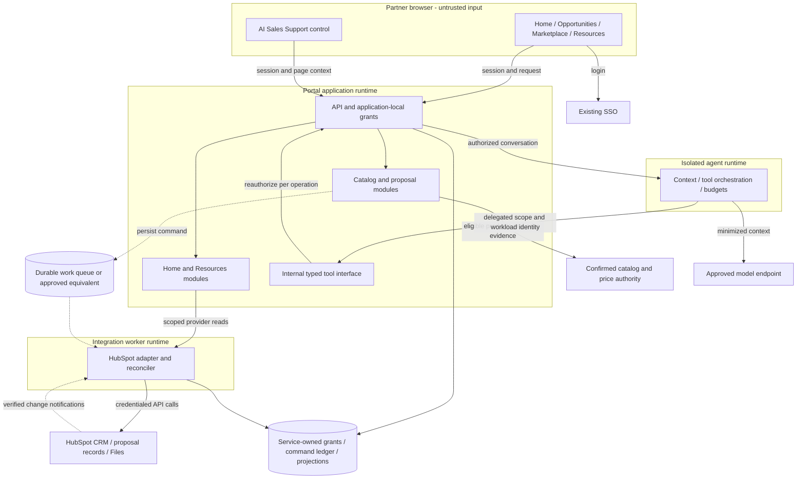
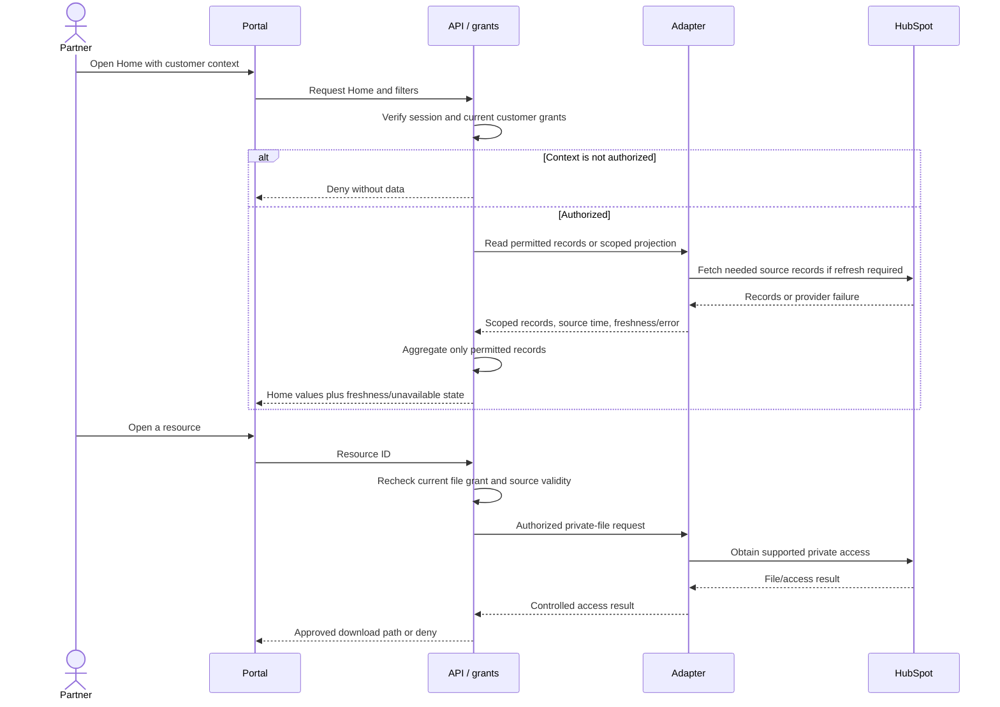
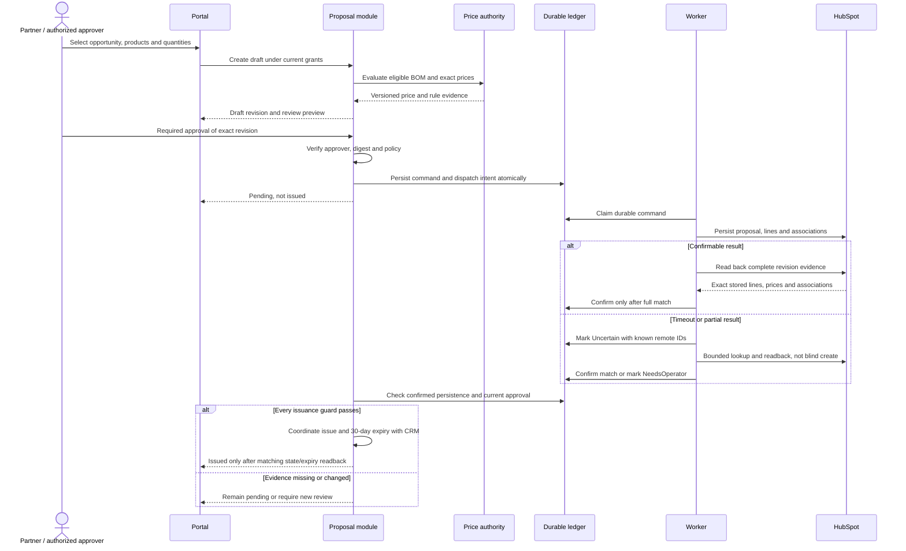

# Feature comparison and visual execution model — P1–P3

8 October 2026. **Design for review, not implementation approval.** This addresses the request for feature-level comparisons and an execution model. Read alongside the [integration architecture and cost model](integration-architecture-p1-p3.md). The earlier CTO deck does not contain these matrices or sequences. Existing EA/user/owner/Security gates remain unchanged.

## How to read the comparisons

**Native** = documented product building block, not proof our subscription includes it. **Configure** = configure that building block and verify the required behavior. **Build** = our code/integration responsibility. **Verify** = insufficient evidence; blocks selection if mandatory. **Excluded** = deliberately outside the initial route. A cell may contain both native and build work. These are capability assessments, not executed test results or vendor scores.

Options are compared at the same layer. n8n is orchestration, not a replacement CRM; Medusa is a catalog/commerce foundation, not a complete HubSpot proposal integration; vLLM serves models, not the whole agent. The complete alternatives below include the surrounding portal and authorization work.

## P1 — feature matrix: integration implementation

| Required feature | A: Owned adapter + worker | B: n8n + owned portal API | C: HubSpot workflows + owned portal API |
| --- | --- | --- | --- |
| HubSpot Home data and scoped totals | Build mappings, reads and aggregation | Build mappings/aggregation; configure workflows where useful | Build portal reads/aggregation; configure supported CRM automation |
| Existing SSO and partner/customer grants | Build local enforcement | Same enforcement; workflow credentials do not replace it | Same enforcement; CRM staff permissions do not replace it |
| Home promotions and lead definitions | Verify source; build agreed projection | Same source decision and projection | Same source decision; verify workflow support |
| Resources metadata search and private opening | Build scoped adapter and download authorization | Build same access API; workflow optional | Build same access API; workflow optional |
| Webhook/event processing and periodic sync | Build signature checks, dedupe and scheduler | Configure supported triggers; build provider/security gaps | Verify supported objects/events/tier; adapter fills gaps |
| Durable uncertain-write reconciliation | Build command ledger and readback | Build ledger; workflow retry alone insufficient | Build ledger; native workflow does not prove portal write outcome |
| Field ownership and conflict handling | Build explicit field/version rules | Same rules in owned API; avoid duplicate workflow writers | Same rules plus native-edit reconciliation |
| Visual workflow editing | Excluded; code-reviewed workflows | Native workflow editor; configure access/release controls | Native workflow tools subject to entitlement |
| Operations and audit | Build dashboards, replay controls and runbooks | Operate adapter plus n8n; verify plan/log retention | Operate adapter plus CRM automation; verify audit coverage |
| Cost driver | Engineering, hosting and on-call | Same core integration plus plan/executions/operations | Same core integration plus incremental HubSpot entitlement |
| Proposed position | Baseline critical path | Optional automation where it removes measured work | Reuse supported CRM automation, not all portal logic |

The workflow approaches can coexist with A; they are alternatives for orchestration work, not three mutually exclusive CRM architectures. n8n documents execution-based plans, workflow tooling and tier-dependent governance. Its management SSO is not portal end-user authorization. [n8n features and plans](https://n8n.io/pricing/).

## P2 — feature matrix: Marketplace and proposals

All options include an owned portal UI/API, application grants, existing SSO and HubSpot integration. “Custom fallback” means supported HubSpot records holding the full proposal evidence, not an external link-only quote store.

| Required feature | A: Native HubSpot quotes | B: Custom proposal + HubSpot | C: Medusa + HubSpot quote route | D: QuoteWerks + HubSpot |
| --- | --- | --- | --- | --- |
| Product administration | Verify existing master fit | Same master decision | Catalog foundation candidate; verify actual required features | Verify catalog ownership and import/update fit |
| Partner product eligibility | Build portal enforcement | Build | Build eligibility/mapping | Verify vendor controls; build portal enforcement |
| Partner-specific prices | Verify source/rules; build enforcement | Build against approved price authority | Verify pricing fit; choose one writer | Verify pricing/rule fit and authority |
| Product selection and quantities | Build portal UI | Build portal UI | Build portal UI over catalog APIs | Build or integrate UI; verify supported access |
| Structured BOM in HubSpot | Native line items; build complete mapping/readback | Build supported structured representation; capability gate | Build Medusa-to-HubSpot mapping; select A or B persistence | Verify connector payload and revisions; build missing integration |
| Proposal template/document | Native templates; configure/test | Build rendering, storage and access | Requires A or B; not supplied by catalog alone | Verify template/export/private access |
| Exactly 30-day validity | Native expiry field; configure clock and renewal controls | Build clock/state controls and stored evidence | Requires selected quote route | Verify expiry semantics and HubSpot consistency |
| Approval workflow | Native workflow/UI building block; verify tier and exact revision binding | Build or reuse supported approval; bind revision | Requires selected quote route | Verify approval, override and edit invalidation |
| Technical configuration/rule validation | Build deterministic rules where required | Build | Build or prove required extensions | Verify actual rule families; no assumed parity |
| Historical price/BOM revisions | Build immutable snapshot and reconciliation policy around records | Build supported version model | Build mapping plus quote-route controls | Verify full historical export and HubSpot persistence |
| No checkout/payment/order | Configure and prove payment/billing disabled | Exclude these actions by design | Exclude order/payment flow; prove quote route | Verify proposal-only mode; exclude order actions |
| Private partner/customer access | Build portal grants; native publication privacy is a hard gate | Build authorized artifact access | Same gate as selected quote route | Verify end-user access, SSO and artifact links |
| Timeout/partial-write recovery | Build ledger/readback/operator flow | Build | Build across catalog and CRM boundaries | Verify connector recovery; build missing controls |
| Export and exit | Verify records, lines, versions and artifacts export together | Build supported export and documentation | Export catalog mappings plus proposal evidence | Verify rights/formats/history; missing evidence blocks selection |
| Incremental cost | HubSpot entitlement + owned integration | More owned proposal engineering/maintenance | Catalog platform/hosting + mappings + quote route | Vendor seats/connector + integration/support, quote needed |
| Proposed position | First proof candidate | Fallback if A fails a mandatory requirement | Add only for a demonstrated catalog gap | Evaluate only for a demonstrated quoting gap |

The native quote API documents expiry, line/contact/deal associations and approval states largely handled by UI/workflows. That does not establish our account entitlement or complete BOM revision controls. Connected payment defaults and public publication must be assessed before use. [HubSpot quote documentation](https://developers.hubspot.com/docs/api-reference/latest/crm/objects/quotes/guide).

Medusa's earlier quote example remains research context; it could not be refreshed through the web reader on 8 October. No ready-made proposal or approval capability is certified here. QuoteWerks cells deliberately remain unverified until candidate evidence is collected. CloudBlue and ERPNext remain parked wider-scope alternatives; they are not shortlisted or feature-certified for this reduced brief.

## P3 — feature matrix: complete agent approaches

C still needs either managed or self-hosted inference; it is an orchestration alternative, not a third model-hosting category.

| Required feature | A: Owned agent + managed inference | B: Owned agent + vLLM/model | C: n8n agent + governed tools |
| --- | --- | --- | --- |
| Persistent assistant across all pages | Build shared UI/context integration | Build same UI/context integration | Build/integrate UI; same context rules |
| CRM and product tool calls | Build typed tools; verify model tool quality | Same tools; verify chosen model support/quality | Configure nodes; call same narrow authorized tools |
| Resources grounding and citations | Build authorized retrieval/source references | Build same retrieval | Build/configure same retrieval and citation checks |
| Cross-customer isolation and revocation | Build server checks; verify provider retention | Build checks plus serving/cache isolation | Build checks plus workflow/log isolation |
| Accurate prices and BOM quantities | Deterministic pricing tool; model explains results | Same | Same |
| Human review of draft proposals | Route to P2; no model issuance | Same | Same; no broad CRM write nodes |
| Model serving/capacity | Provider operates; verify quotas/region | Operate GPUs, redundancy, upgrades and model rights | Depends on chosen inference backend |
| Prompt/tool evaluation | Build shared evaluation suite | Same suite, plus serving performance tests | Same suite, plus workflow/version tests |
| Tracing and spend limits | Build per-session budgets and redacted audit | Build budgets, capacity and utilization metrics | Configure execution controls plus model budgets |
| Data-region and use terms | Verify contract/model/region | Verify model license and hosting policy | Verify both orchestration and inference vendors |
| Visual agent workflow editing | Excluded unless separately added | Excluded unless separately added | Native tooling; configure governance |
| Cost driver | Tokens/calls + tools/storage + engineering | GPU-hours/replicas + operations + engineering | Workflow executions + inference + owned tools |
| Proposed position | Leading operating model, no provider selected | Challenger when policy/utilization justifies it | Optional if visual workflow ownership is valuable |

[vLLM documentation](https://docs.vllm.ai/en/latest/) establishes a model-serving foundation, not a turnkey sales agent. Model licenses and tool quality need separate evidence. AI accuracy, isolation and latency are future acceptance results, not claims from these matrices.

## Execution model 1 — where components run

Solid arrows show synchronous calls. Dotted arrows show durable work or event delivery. Boxes represent proposed runtime/trust boundaries; internal modules are not automatically separate microservices. Infrastructure vendor, physical tenancy and resource sizing remain owner decisions.



Only the adapter holds HubSpot credentials; its scoped read interface cannot be an unrestricted proxy. Internal tool calls enter a separate operation dispatcher, never the chat endpoint. The database symbol is a logical grouping of owned stores, not approval for a shared multi-customer database. AI has no SQL path. Worker retries and inference loads have independent limits. No Site Designer or Discovery runtime exists in this scope.

## Execution model 2 — P1 Home and Resources read



The file branch runs only after authorization succeeds. Signed bearer URLs require accepted expiry/revocation limits; use a controlled download proxy when needed. Failed refresh cannot silently appear as zero sales. Background change processing invalidates/rebuilds scoped projections; read access still rechecks grants.

## Execution model 3 — P2 proposal creation and uncertain result



The ledger/dispatch step requires an atomic outbox or equivalent durable guarantee, not two uncoordinated writes. Issuance uses the same recoverable command discipline if it changes HubSpot. Customer sending is separately authorized. No checkout or order step. An expiry or edit produces a non-current revision; renewal requires a new evaluation and approval. Exact clock and price-honoring policy remain owner gates.

## Execution model 4 — P3 AI support and proposed action

```mermaid
sequenceDiagram
  actor Partner
  participant Portal
  participant API as API / grants
  participant Agent
  participant Model
  participant Tool as Authorized provider tools
  Partner->>Portal: Ask about current opportunity
  Portal->>API: Question and page context
  API->>API: Resolve trusted user and permitted context
  API->>Agent: Narrow delegated context and limits
  Agent->>Model: Minimized prompt and allowed tool definitions
  Model-->>Agent: Proposed tool call
  Agent->>Tool: Typed call with user scope and workload identity
  Tool->>Tool: Reauthorize context, fields and operation
  alt Tool request permitted
    Tool-->>Agent: Scoped source evidence and versions
    Agent->>Model: Evidence marked as untrusted content
    Model-->>Agent: Draft response or BOM suggestion
    Agent-->>Portal: Cited answer / proposed draft, no issuance
    Partner->>API: Explicitly submit reviewed draft to P2
    API->>API: Reauthorize and evaluate through proposal workflow
  else Context revoked, unsupported or unsafe
    Tool-->>Agent: Deny or unavailable
    Agent-->>Portal: Explain limitation; manual workflow remains
  end
```

A customer switch cancels/revalidates pending tool results before display. Model output never establishes price or permission. Tool budgets, prompt-injection cases and source revocation are acceptance gates. During AI outage, manual journeys continue; the initial P1–P3 release still requires working AI support.

## Common proof cases and decision outcome

| Proof | Applies to | Owner / backlog |
| --- | --- | --- |
| Same partner, different customer cannot read totals/files/AI context | Every complete option | Security/Application; R06/R11/R54/R59 |
| Full versioned BOM in correct HubSpot opportunity; native edit invalidates stale approval | Every P2 option | CRM/Commercial; R05/R20/R56/R57 |
| Exactly 30 days, no payment, private access policy satisfied | Every P2 option | Commercial/Security; R26/R56/R57 |
| Timeout after remote success never blindly creates duplicate | Every integration approach | Integration owner; R16/R18/R20 |
| Grounded answer and human-reviewed draft; no model-issued proposal | Every P3 option | AI/Product; R34/R58/R59/R60 |
| Equal workload, required controls and 36-month costs | All shortlisted complete stacks | Delivery/Platform; R08/R39 |

Recommendation remains A for the owned P1 integration path, P2 native HubSpot proof first, and managed inference with owned P3 authorization/tools. These are conditional recommendations, not a completed procurement decision. Unknown mandatory features block selection. Published price inputs and formulas remain in the [cost comparison](integration-architecture-p1-p3.md#costs-comparable-inputs-not-a-fictitious-fixed-budget); actual account, volume, policy and operating inputs are still missing. No numerical score masks those unknowns.
