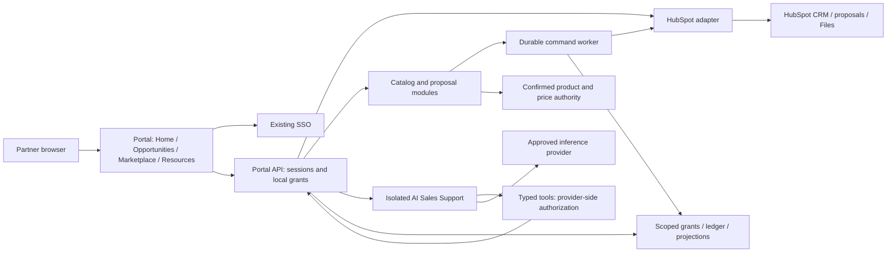

# P1–P3 integration architecture and decision comparison

7 October 2026. Proposed design for EA and owner review; no product, infrastructure or account configuration is authorized. Confirmed priorities remain unchanged. This deepens the [proposal](proposal.md), [boundaries](service-boundaries.md) and [contracts](contracts.md). The revision-4 deck summarizes scope but does not contain this detailed comparison; review it with this document. No prior review approves these new recommendations.

## Recommended composition

Use existing SSO, one portal experience, a modular integration backend, a durable background worker and an independently isolated AI Sales Support runtime. Keep catalog/proposal/CRM adapters as explicit modules with contracts initially; separate them into independently deployed services only when ownership, scaling, provider access or recovery demands it. The AI runtime separation is a recommendation requiring EA/Platform acceptance, not an approved topology. A worker can share the backend release artifact while using a separate process and restricted identity.

The tool arrow back to the API represents a dedicated internal tool interface, not a recursive chat call. Every tool invocation validates delegated user scope and workload identity. No model or browser receives CRM credentials. Diagram describes logical boundaries, not a selected cloud or provisioning plan.

| Component | Owned state / accountable role | Deployment recommendation and separation trigger |
| --- | --- | --- |
| Portal UI/API | Sessions, application grants and read composition; application owner | Single experience/API initially. SSO authenticates; API authorizes each partner/customer/solution/environment/workspace grant |
| HubSpot adapter and worker | Provider mappings, command IDs, retry/reconciliation records; integration owner with CRM admin | Module plus durable worker; sole CRM credential holder. Extract service if multiple independent consumers need an owned provider API or separate credential boundary |
| Catalog | Product eligibility and source-version references; Catalog/Commercial | Module over confirmed master. No new catalog master by default; Medusa adds a separately operated product only after gap evidence |
| Proposal | Revision, configuration digest, rule version, approval evidence and persistence state; Commercial/Technical | Module with one authority per field. Workflow ledger does not become a second CRM or competing price engine |
| AI Sales Support | Scoped short-lived conversations, evaluation and tool audit; AI owner | Separate runtime recommended for inference egress, spending, untrusted inputs and independent shutdown; cannot access backend tables |
| Resources | HubSpot source files; minimal searchable metadata projection; content owner | Adapter capability, no replacement document master. Add full-text/vector index only after need and deletion/ACL proof |
| Persistence/operations | Local grants, durable ledger and minimized projections; Platform/data owners | Prefer approved managed relational storage and job facility if available. Separate service-owned credentials/schemas; no cross-service SQL. Physical placement follows isolation matrix and data policy |

Independent capabilities retain clear contracts even when modules share deployment. Do not introduce a separate microservice for every menu entry. Do not initialize Site Designer, Discovery, a standalone multisite service or a general-purpose exchange platform.

## P1 — HubSpot integration design

**Read path:** SSO session → resolve local grants → intersect authorized CRM references with requested filters → HubSpot adapter or scoped projection → calculate scoped totals → return source timestamp and freshness. Do not fetch broad totals and filter the displayed rows afterward. Proposed Deal/Company/Contact mappings require CRM-owner acceptance; lead and promotion representations are unresolved. Home must distinguish no results, stale results and provider outage.

**Synchronization:** use supported verified notifications for subscribed changes and bounded scheduled reconciliation for missed events and unsupported objects. Persist dedupe/correlation IDs, treat notifications as prompts for authoritative readback, and tolerate duplicate/out-of-order deliveries. Snapshot/bootstrap must reconcile changes arriving during pagination. Rate-limit by HubSpot account and endpoint; reserve capacity for proposal confirmation so AI reads cannot starve it. Exact quotas depend on app/account/API, not one universal limit. Start with server cache/projections only where justified; owner sets TTL, freshness, revocation and recovery limits before real use. [HubSpot API limits](https://developers.hubspot.com/docs/developer-tooling/platform/usage-guidelines).

**Resources:** authorized metadata search/filter → reauthorize file at open → private download through approved mechanism. HubSpot supports signed access for private files; signed URLs are bearer access, so the design must assess expiry and revocation limits. For sensitive files prefer a controlled proxy if a signed URL cannot meet the required revocation bound. Never expose a complete account-wide file index. AI retrieval applies the same checks and treats file content as untrusted. [Files API](https://developers.hubspot.com/docs/api-reference/latest/files/guide).

**App registration:** assess a supported private distribution/single-account integration if one company account serves the portal; evaluate OAuth installation per account if multiple independently administered HubSpot accounts are actually needed. CRM admin confirms current platform app model, scopes and rights. External portal users are not assumed to require HubSpot seats, nor assumed exempt: confirm contractual and workflow access with the provider.

| P1 option | Functionality and benefit | Effort, cost and limitations | Position |
| --- | --- | --- | --- |
| Owned typed adapter + worker | Consistent grants, metrics, versioning, readback and controlled CRM writes | Engineering/on-call burden; own API compatibility, secrets, dedupe and recovery | Recommended critical integration path |
| n8n workflows behind owned API | Visual orchestration for notifications, scheduled sync and operator workflows | Additional platform/execution cost; workflow credentials/logs and retries must meet isolation. Does not replace API grants or uncertain-write ledger | Optional supporting automation after a concrete need |
| HubSpot-native workflows plus portal adapter | Reuse CRM administration and supported approval processes | Account feature/seat dependence; native workflows cannot be assumed to enforce all external portal grants | Use where account capability and controls are proven |

No browser-to-HubSpot administrative calls, generic agent CRM proxy or blind workflow retries. Existing SSO is reused; this work requests no identity-provider modification.

## P2 — Marketplace and proposal integration

Catalog browsing reads eligible products from the confirmed master. Server-side evaluation returns decimal amounts, currency/term, source price version and expiry, configuration digest and rule version. Store immutable line snapshots per proposal revision. Never reconstruct an issued BOM using today's product records.

**Command path:** authorized selection → evaluate → draft revision → required human approval → durable persist command → create/associate supported HubSpot records → verify line-by-line readback → approved issuance → 30-day expiry. Sending is a separate permission. Technical or commercial edits invalidate the applicable approval; native HubSpot edits must trigger reconciliation and block use of stale approval. The exact clock, rounding, tax, discount authority and price-honoring policy remain Commercial gates.

Local persistence states are Pending, Uncertain, Confirmed and NeedsOperator, separate from commercial draft/approved/issued/expired states. An ambiguous timeout triggers lookup/readback with the saved command reference, not a new create. Bound retries and delayed-visibility checks; if uniqueness cannot be established, escalate for operator reconciliation. Handle partial line/association creation explicitly. A draft may remain pending during CRM outage; issuance must fail closed until complete evidence is confirmed. No payment, auto-invoice/subscription, order or automatic deal-won.

| P2 option | Products and pricing | Proposal/BOM and approvals | Cost/operations/exit | Recommendation |
| --- | --- | --- | --- | --- |
| Thin portal + existing catalog + native HubSpot quotes | Small owned browsing/eligibility layer; reuse maintained master | Native records first candidate; must prove full BOM, versions, 30-day semantics and native-edit safeguards | Incremental HubSpot entitlements plus integration/ops; fewer masters. Export line snapshots and authority history | First route to prove, not selected |
| Thin portal + supported HubSpot proposal representation | Same catalog path | More custom rendering/state; full structured BOM/revision/artifact must reside in supported HubSpot features | More build and maintenance; possible account upgrades; owns template and state migration | Fallback only with demonstrated native gap and supported persistence |
| Medusa + HubSpot | Reusable catalog/pricing administration; determine single writer and source mappings | HubSpot adapter and proposal controls still required | Adds runtime, catalog lifecycle and synchronization; export/mapping/upgrade work | Use only when catalog complexity justifies it |
| QuoteWerks + HubSpot | Specialist quoting challenger | Verify exact integration writes full agreed BOM/revision evidence into HubSpot; no assumed connector parity | Vendor quote, user rights, connector/version support and another authority boundary | Escalation after a documented CPQ gap |
| CloudBlue or ERPNext | Wider commerce/business scope | Additional authority and integration assessment | More scope to operate and exit; price/rights evidence not refreshed for this round | Park unless the brief changes |

Current HubSpot documentation requires a qualifying Revenue Hub subscription for new quotes, with legacy exceptions. It documents expiry, required associations and mainly UI/workflow-managed approval states. Quotes need distinct line items rather than sharing deal lines. Connected payment processors can enable billing/payment behavior by default; prove both disabled. Published quote links can be public: assess that against classification before choosing native publication, and reject this route for private-only material unless an approved access mechanism is proven. These are documented constraints, not evidence of our account's behavior. [Quotes API](https://developers.hubspot.com/docs/api-reference/latest/crm/objects/quotes/guide).

## P3 — AI Sales Support integration

Every active page has the same persistent agent control with a visible active customer/opportunity. Context changes clear or reauthorize state. Initial typed tools: `getAuthorizedOpportunity`, `searchEligibleProducts`, `findPermittedResources`, `evaluateDraftBOM`. Names are conceptual contracts, not implemented endpoints. Draft suggestions are reviewed through the P2 workflow; the agent cannot approve, issue or send. Price arithmetic and eligibility are deterministic provider operations, not model assertions.

Retrieve small authorized source excerpts with IDs/versions and citations. Start with live structured tools plus permitted resource metadata/content; a vector database is optional, not an architectural prerequisite. If added, enforce source ACL/version at retrieval and final read, purge on revocation and prove isolation during restore. Untrusted content cannot expand tool permissions. Cap context/output, tool calls, time and spend per session; redact secrets and minimize PII in traces. AI outage leaves manual Home/Marketplace/Opportunities/Resources usable, while mandatory AI acceptance remains required for release completion.

| P3 option | Features/functionality | Cost and responsibilities | Position |
| --- | --- | --- | --- |
| Owned agent + managed inference, e.g. Amazon Bedrock | Provider abstraction; typed tools and deterministic authority remain ours; evaluate model quality for BOM explanations and retrieval | Usage-based inference plus orchestration, retrieval, logs and provider/region governance; no GPU serving to operate | Recommended operating model pending existing-cloud/data-policy fit; AWS itself not selected |
| Owned agent + self-hosted vLLM and separately licensed model | More model/runtime control; same portal tools and authorization needed | GPU capacity, redundancy, utilization, patching, model license, serving/on-call and evaluation costs | Challenger when policy or measured sustained load justifies it |
| n8n agent workflow behind owned tool API | Visual agent/workflow maintenance | Extra execution charges and governance surface; prove context isolation, tool constraints and auditable deployment | Optional orchestration alternative; not the authority layer |

[Bedrock pricing](https://aws.amazon.com/bedrock/pricing/) varies by model, region and inference mode. [vLLM documentation](https://docs.vllm.ai/en/latest/) describes a serving runtime; this is not a model license or turnkey sales agent. Final provider/model comparison must use the same authorized synthetic test set, latency target, citation/price accuracy and isolation requirements. No provider benchmark has been executed.

## Costs: comparable inputs, not a fictitious fixed budget

Public-page snapshot checked 7 October 2026. Prices below are advertised entry points, not quotations, our entitlement or complete production costs. Currency, tax, commitment, region, support and required controls matter. Do not combine EUR/USD without a dated finance-approved exchange rate.

| Item | Verified public basis | Budget treatment |
| --- | --- | --- |
| HubSpot | Revenue pricing page plus account-specific seats/features; numeric applicable price not established here | CRM admin supplies current invoice, seats and upgrade quote. Count incremental cost for decision; also disclose allocated existing cost in total program TCO |
| Medusa Cloud | Develop from USD 29/month, Launch 99, Scale 299; Enterprise custom | 99/month is 1,188/year and 3,564 over 36 months before other costs. It is not evidence Launch satisfies our controls or capacity |
| n8n | Starter EUR 20/month annual billing/2,500 executions; Pro 50/10,000; Business self-hosted 667/40,000; Enterprise quoted | Pro base is EUR 600/year; Business 8,004/year plus hosting. Governance/rights may require a different plan; do not assume Community is unrestricted open source |
| Managed AI | Model/region/token or provisioned-capacity pricing | Model rates, context, call volume and tools determine spend; select no model from a headline rate alone |
| Self-hosted AI | No infrastructure quote obtained | GPU-hours × hourly rate × replicas + storage/network + serving/operations; include idle and failover capacity |
| Owned portal/integration | No new packaged-software fee asserted; labor and infrastructure required | Size engineering, integration tests, maintenance, security, restore and on-call separately |

Sources: [HubSpot Revenue](https://www.hubspot.com/pricing/revenue), [Medusa](https://medusajs.com/pricing), [n8n](https://n8n.io/pricing/). Hosted management/enterprise entitlements do not automatically establish portal end-user SSO or isolation.

Use the same 36-month scope for each complete stack:

`TCO = discovery/build/migration + 36 × (incremental licenses + hosting + inference + monitoring + support labor + data stewardship) + exit/recovery costs`.

Record existing allocated licenses separately so reuse is visible without claiming HubSpot is free. For buying a component, compare added subscription/integration cost with the maintenance effort it actually removes; a catalog engine does not remove portal authorization or CRM reconciliation work.

Illustrative workload assumptions ONLY, not forecasts: small case 100 active partners × 10 AI sessions/month × 2 model calls = 2,000 calls; larger case 500 × 20 × 3 = 30,000 calls. At 4,000 input and 1,000 output tokens per call, these mean 8M/2M and 120M/30M input/output tokens. Monthly inference cost is `8 × input_rate + 2 × output_rate` or `120 × input_rate + 30 × output_rate`, with rates per million tokens. Add retries, retrieval, tools, embeddings and logs; replace assumptions with measured context sizes. Self-hosting wins only if its full serving/operations cost at equivalent quality and latency is lower. No break-even volume is known yet.

API cost/capacity worksheet must count page requests, cache hits, initial sync, changes, resource opens, proposal lines/readbacks and agent tool calls; do not assume one proposal equals one API call or one workflow execution. Required owner inputs: current HubSpot subscription, catalog source/SKU and price-update counts, active/concurrent partners, proposals/month and lines/proposal, AI sessions/context, region, security tier, labor rates and SLO/RTO/RPO.

## Selection evidence and actionable planning sequence

Hard gates precede weighted scoring: vendor rights, grants/isolation, supported full HubSpot BOM persistence, 30-day semantics, no checkout, export/exit, SSO and operational ownership. A failed/unknown mandatory gate cannot be offset by low cost. Once passed, suggested review weights are functional fit 30%, 36-month TCO 25%, delivery/maintenance 20%, operations/recovery 15%, portability 10%; these weights need owner agreement and no candidate has been scored yet.

| Existing backlog IDs | Small next planning deliverable | Acceptance / accountable role |
| --- | --- | --- |
| R02/R03/R51/R53 | Account capability inventory and one field/access matrix | Record actual account evidence; map Home metrics, opportunity relationships, promotions and private Resources; CRM admin/Product |
| R06/R11 | One grant/identity sequence and negative-case set | Same-partner different-customer, revoked user, direct URL and file/tool bypass fail closed by design; SSO/Security |
| R04/R05/R56 | Native versus fallback proposal proof specification | Exact supported schema, per-revision lines, 30-day clock, public-link/payment disposition and edit invalidation; Commercial/Technical |
| R16/R18/R20/R57 | Integration command/reconciliation contract | Partial write, timeout-after-success, delayed visibility, replay and operator limits; integration owner |
| R08/R39 | Cost worksheet and operator/hosting assessment | Fill actual inputs and compare equal-scope 36-month stacks with recovery and exit; Delivery/Platform |
| R34/R35/R58/R59 | Agent tools/context contract and model evaluation specification | Same authorized tasks for managed/self-hosted options; accuracy, latency, cost, injection and revocation cases; AI/Security |
| R54/R26/R60 | Separate synthetic and real-use acceptance plans | Measurable limits, named operators and user/EA/affected-owner/Security evidence before each exposure |

These refine existing items, not new completed work or issue-tracker mutations. Resolve P1 object/access constraints before final P2 vendor selection; reuse those contracts for P3. Planning/evaluation specifications can proceed now. Runtime proofs, installations, trials and real data remain gated. Unknown timing, policy durations, owner names and account rights remain explicitly in [OD-01–OD-10](decisions/open-decisions.md).
